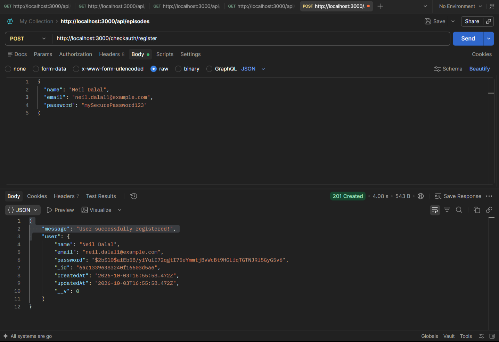
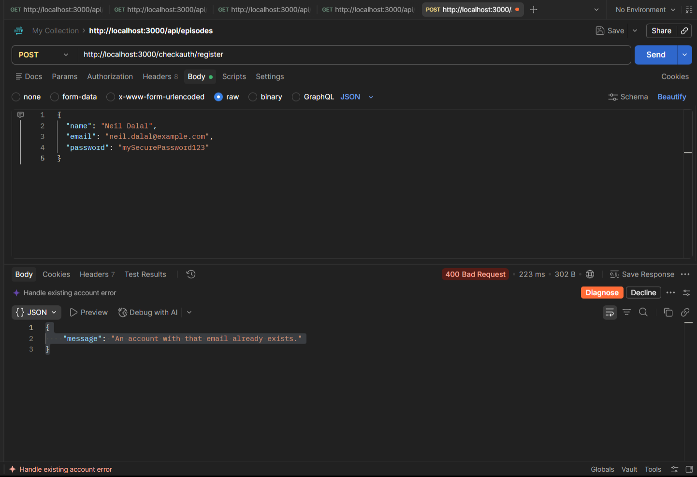
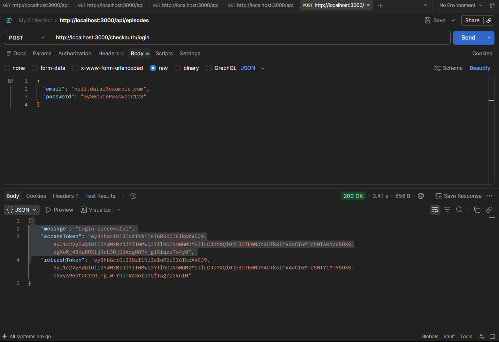
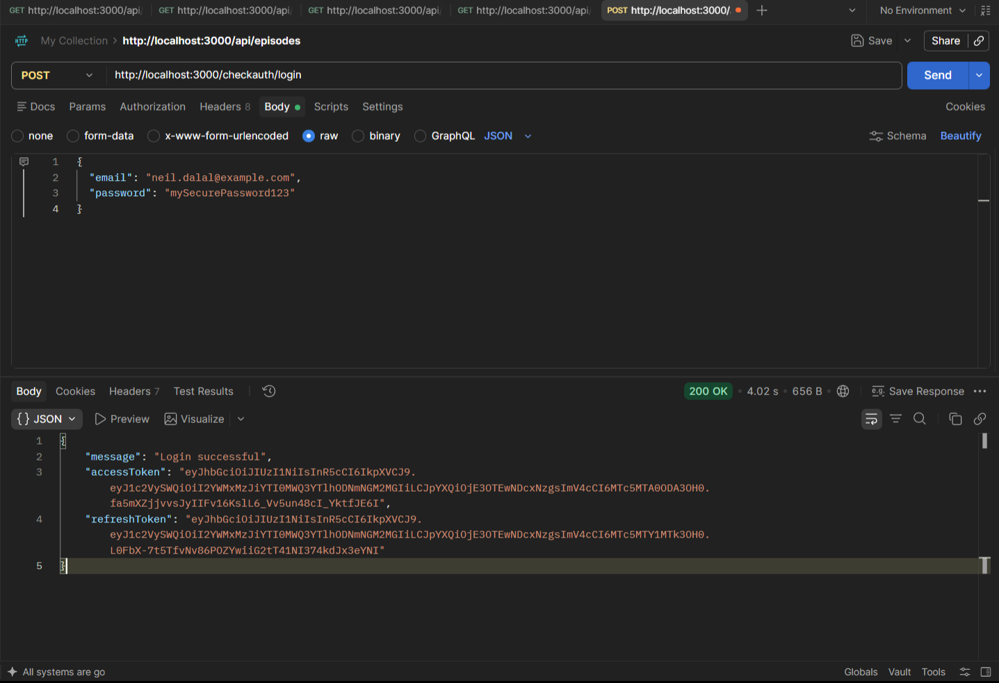
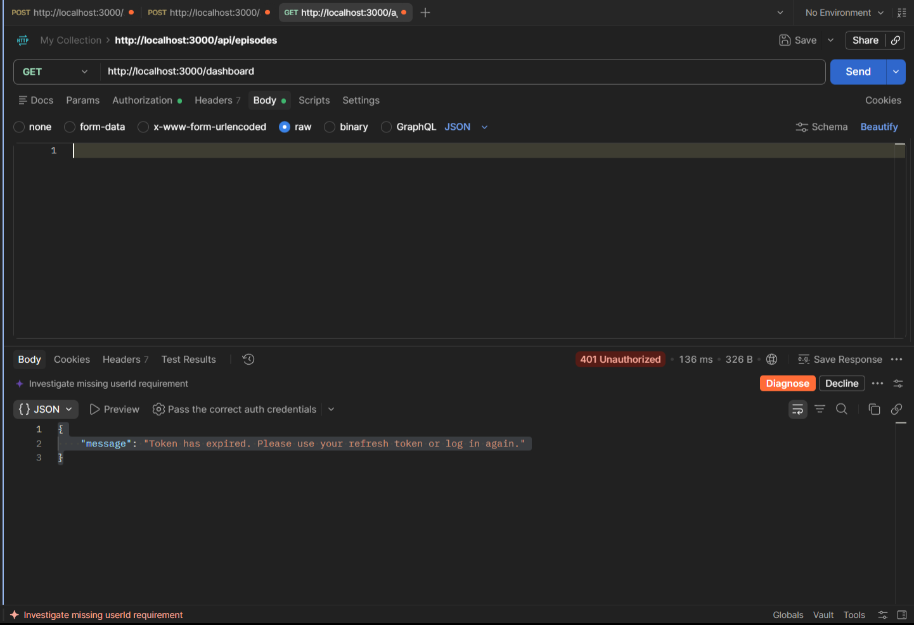
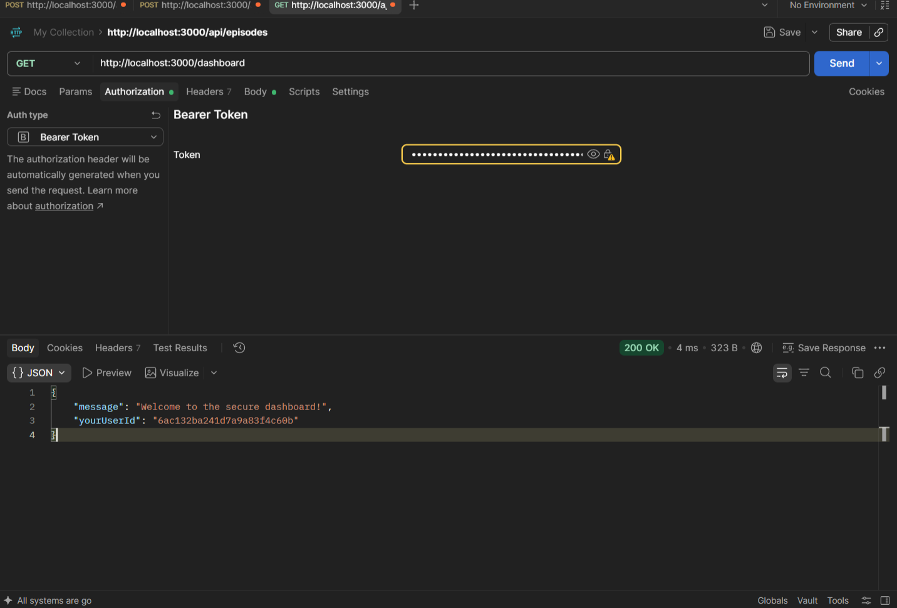
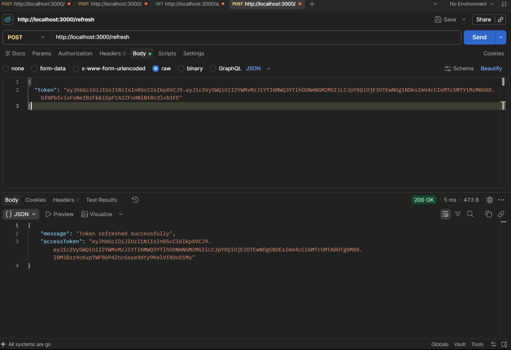

# Backend Node – Task 2: Secure User Authentication System

A secure authentication API built with **Node.js**, **Express**, **MongoDB Atlas (Mongoose)** and **JWT**, following a strict **MVC** structure. Includes password hashing, access/refresh tokens, route-protecting middleware, and email notifications via **Nodemailer**.

**Author:** Neil Dalal · DJ Unicode – Backend (Node.js) Track

---

## Features

- User registration and login
- Password hashing with `bcryptjs` (no plain-text passwords stored)
- JWT authentication with **access** and **refresh** tokens
- Auth middleware that verifies the JWT and attaches only the user's ID to `req`
- Protected route (`/dashboard`)
- Welcome email on registration, login notification email on login (Nodemailer)
- Mongoose validation for name, email and password; automatic `createdAt` / `updatedAt`
- All secrets and SMTP credentials stored in `.env`

## Tech Stack

| Layer | Tech |
|---|---|
| Runtime / Framework | Node.js, Express |
| Database | MongoDB Atlas + Mongoose |
| Auth | JWT (`jsonwebtoken`), `bcryptjs` |
| Email | Nodemailer |
| API Testing | Postman |

## Project Structure (MVC)

```
.
├── config/
│   └── db.js                 # MongoDB Atlas connection
├── controllers/
│   └── authController.js     # register, login, refresh, dashboard logic
├── middleware/
│   └── authMiddleware.js     # JWT verification, attaches req.userId
├── models/
│   └── User.js               # Mongoose User schema
├── routes/
│   └── authRoutes.js         # Route definitions only (no business logic)
├── utils/
│   └── sendEmail.js          # Nodemailer helper
├── screenshots/              # Postman test screenshots
├── .env                      # Secrets (not committed)
├── .gitignore
├── package.json
├── README.md
└── server.js                 # App entry point
```

## User Model

```js
{
  _id: ObjectId(),
  name: String,
  email: String,      // validated, unique
  password: String,   // bcrypt hash
  createdAt: Date,    // timestamps
  updatedAt: Date     // timestamps
}
```

## Setup

### 1. Clone and install

```bash
git clone <your-repo-url>
cd <project-folder>
npm install
```

### 2. Configure environment variables

Create a `.env` file in the project root:

```env
PORT=3000
MONGO_URI=<your MongoDB Atlas connection string>

JWT_ACCESS_SECRET=<random string>
JWT_REFRESH_SECRET=<different random string>
JWT_ACCESS_EXPIRES_IN=15m
JWT_REFRESH_EXPIRES_IN=7d

SMTP_HOST=<smtp host>
SMTP_PORT=587
SMTP_USER=<smtp username>
SMTP_PASS=<smtp password / app password>
EMAIL_FROM=<sender address>
```

### 3. Run

```bash
npm start
# or
npm run dev
```

Server runs at `http://localhost:3000`.

---

## API Endpoints

| Method | Endpoint | Auth | Description |
|---|---|---|---|
| POST | `/checkauth/register` | No | Register a new user, sends welcome email |
| POST | `/checkauth/login` | No | Login, returns access + refresh tokens, sends login notification email |
| GET | `/dashboard` | Bearer access token | Protected route, returns authenticated user's ID |
| POST | `/refresh` | No (refresh token in body) | Issues a new access token |

---

## API Testing (Postman)

All endpoints were tested using Postman.

### 1. Register – `POST /checkauth/register`

**Request body**
```json
{
  "name": "Neil Dalal",
  "email": "neil.dalal1@example.com",
  "password": "mySecurePassword123"
}
```

**Success – `201 Created`.** The password is stored as a bcrypt hash.



**Duplicate email – `400 Bad Request`.** Registering with an already-used email is rejected.



### 2. Login – `POST /checkauth/login`

**Request body**
```json
{
  "email": "neil.dalal@example.com",
  "password": "mySecurePassword123"
}
```

**Success – `200 OK`.** Returns `accessToken` and `refreshToken`.





### 3. Protected Route – `GET /dashboard`

**Without a valid token / expired token – `401 Unauthorized`.**



**With a valid access token (Authorization → Bearer Token) – `200 OK`.** The middleware verifies the JWT and attaches only the user's ID to the request.



### 4. Refresh Token – `POST /refresh`

**Request body**
```json
{
  "token": "<refreshToken>"
}
```

**Success – `200 OK`.** Returns a new access token.



---

## Authentication Flow

1. **Register** → password hashed with bcryptjs → user saved → welcome email sent.
2. **Login** → credentials verified → access + refresh tokens issued → login notification email sent.
3. **Access protected route** → send `Authorization: Bearer <accessToken>` → middleware verifies JWT and sets `req.userId`.
4. **Access token expires** → `401` returned → client sends refresh token to `/refresh` → new access token issued.

## Security Notes

- Passwords are hashed with `bcryptjs`; plain-text passwords are never stored.
- JWT secrets and SMTP credentials live in `.env` only (add `.env` to `.gitignore`).
- Only the user's ID is stored on `req`, not the full user object.
- Email and password validation are enforced in the Mongoose schema.

## Learning Resources

- [Express Middleware](https://www.geeksforgeeks.org/node-js/explain-the-concept-of-middleware-in-nodejs/)
- [JWT Introduction](https://www.jwt.io/introduction#what-is-json-web-token)
- [Nodemailer](https://www.npmjs.com/package/nodemailer)
- [MVC – MDN](https://developer.mozilla.org/en-US/docs/Glossary/MVC)
- [MongoDB Documents](https://www.mongodb.com/docs/manual/core/document/)
